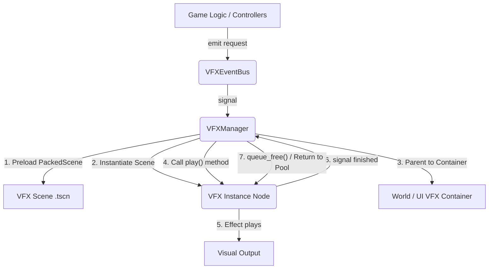

# VFX System Design Specification v1.0

## 1. Introduction
This document details the architecture and design of the centralized Visual Effects (VFX) system implemented within the Prismatica project. The primary goal of this re-architecture was to establish a robust, flexible, and performant framework for managing in-game visual effects, ensuring clear separation of concerns, ease of use for content creators/designers, and extensibility for future VFX types and optimizations.

## 2. Core Principles & Design Goals
*   **Centralized Control (Orchestration):** A single, dedicated manager (`VFXManager`) is responsible for the entire lifecycle of VFX instances, from creation to destruction/recycling.
*   **Decoupling:** Game logic systems should request VFX without needing to know the implementation details of how VFX are spawned, animated, or cleaned up.
*   **Extensibility:** Adding new VFX types should be straightforward, primarily involving the creation of a new VFX scene and minimal configuration in the manager.
*   **Performance:** The system is designed with future optimizations (e.g., object pooling) in mind to efficiently handle numerous short-lived effects.
*   **Type Safety:** Leveraging Godot's `class_name` and type hinting for clearer code and reduced runtime errors.
*   **Configurability:** VFX properties (colors, positions, timings) are driven by parameters passed to individual VFX instances and configured directly within their respective scenes in the editor.

## 3. Architecture Overview

The VFX system follows a Manager-Orchestrated Instantiation pattern, mediated by an Event Bus.

## 4. Component Breakdown

### 4.1. `VFXManagerClass` (`VFXManager.gd`) - The Orchestrator

*   **Type:** Godot Autoload (Singleton)
*   **Location:** `godot/game/scripts/vfx/vfx_manager.gd`
*   **Purpose:** To serve as the central hub for all VFX operations.
*   **Key Responsibilities:**
    *   **VFX Scene Management:**
        *   Preloads `PackedScene` resources for all registered VFX types (e.g., `core_click_vfx.tscn`, `currency_flight_vfx.tscn`).
        *   Maintains constants for paths to VFX scenes.
    *   **Event Handling:** Connects to specific signals emitted by `VFXEventBus` (e.g., `play_core_click_vfx_requested`).
    *   **Instantiation:** Upon receiving a request, it calls `PackedScene.instantiate()` to create a new `VFX Instance Node`.
    *   **Type Casting:** Safely casts the generic `Node` returned by `instantiate()` to its specific `class_name` (e.g., `CoreClickVFX`, `CurrencyFlightVFX`).
    *   **Parenting:**
        *   Manages dedicated container nodes in the scene tree:
            *   `_world_vfx_container`: A `Node2D` (e.g., in `main.tscn`) for world-space effects.
            *   `_ui_vfx_container`: A `CanvasLayer` (e.g., the root of the `HUD` scene) for UI-overlay effects.
        *   Adds the new `VFX Instance Node` to the appropriate container using `add_child()`.
    *   **Activation:** Calls the `play()` method on the newly instantiated `VFX Instance Node`, passing parameters received from the event bus (position, color, etc.).
    *   **Lifecycle Management:** Connects to the `finished` signal emitted by the `VFX Instance Node`. Once the effect is complete, `VFXManager` calls `queue_free()` on the instance, ensuring proper cleanup.
    *   **Error Handling:** Includes `printerr` statements for failed `PackedScene` loads, instantiation failures, or invalid container nodes.
    *   **Audio Bridge:** Contains `play_sfx_2d()` to convert 2D positions to 3D and emit `CoreEventBus.sfx_play_requested`, maintaining core infrastructure integration.
*   **Constants:** Defines constants for common values like `GRID_UNIT_SIZE`, VFX colors, and target positions, enhancing configurability.

### 4.2. `VFXEventBusClass` (`VFXEventBus.gd`) - The Communication Hub

*   **Type:** Godot Autoload (Singleton)
*   **Location:** `godot/game/scripts/autoload/vfx_event_bus.gd`
*   **Purpose:** To provide a decoupled communication channel for game systems to request VFX.
*   **Key Responsibilities:**
    *   Defines distinct signals for each type of VFX that can be requested (e.g., `play_core_click_vfx_requested`, `play_currency_flight_vfx_requested`).
    *   Signal parameters carry all necessary information for `VFXManager` to spawn and configure the VFX (e.g., `position`, `color`, `start_screen_pos`, `target_screen_pos`).
    *   Does *not* contain any logic for VFX instantiation or management. It is a pure message passing system.

### 4.3. Individual VFX Scene Scripts (`CoreClickVFX.gd`, `CurrencyFlightVFX.gd`, etc.) - The Visuals

*   **Type:** Node scripts attached to their respective `.tscn` files.
*   **Locations:** E.g., `godot/game/scenes/vfx/core_click_vfx.gd`, `godot/game/scenes/vfx/currency_flight_vfx.gd`.
*   **Purpose:** To define the visual and temporal behavior of a specific effect.
*   **Key Responsibilities:**
    *   **`class_name` Declaration:** Uses `class_name` (e.g., `CoreClickVFX extends Node2D`) for type-safe casting by `VFXManager`.
    *   **Internal Visuals:** Contains the actual `CPUParticles2D`, `Sprite2D`, `AnimationPlayer`, `Tween` nodes, etc., that constitute the visual effect. These are configured directly in their `.tscn` files.
    *   **`play()` Method:** Exposes a public `play()` method that accepts parameters (position, color, etc.) and uses them to configure and activate the visual effect (e.g., `particles.restart()`, `tween.play()`).
    *   **`finished` Signal:** Emits a `signal finished` once the visual effect has completed its intended duration or animation sequence. This signal is crucial for `VFXManager` to know when an instance can be safely removed or recycled.
    *   **No Self-Instantiation:** These scripts do *not* contain `preload()` or `instantiate()` calls for themselves. They are "passive" templates waiting to be instantiated and activated by `VFXManager`.
    *   **Cleanup Mechanism:** The `finished` signal replaces direct calls to `queue_free()` within these scripts, delegating cleanup to `VFXManager`.
*   **Scene Structure (`.tscn` files):**
    *   Each `.tscn` file defines the hierarchy and properties of the visual effect (e.g., `CPUParticles2D` settings, `Sprite2D` textures, `Node2D` as root).
    *   These properties are typically set by designers directly in the Godot editor.

## 5. Interaction Flow

1.  **Request:** A game system (e.g., `GameCore`, `GameSceneController`) determines a VFX is needed.
2.  **Emit Signal:** The game system emits the appropriate signal on the `VFXEventBus` with necessary parameters (e.g., `VFXEventBus.play_core_click_vfx_requested.emit(world_pos, color)`).
3.  **Receive Signal:** `VFXManager` receives this signal.
4.  **Instantiate:** `VFXManager` loads the `PackedScene` (if not already loaded) and calls `instantiate()`.
5.  **Parent & Configure:** `VFXManager` adds the new `VFX Instance Node` to its appropriate world or UI container, and calls its `play()` method with the provided parameters.
6.  **Play Effect:** The `VFX Instance Node` starts its internal animations/particles based on the `play()` call and its `.tscn` configuration.
7.  **Effect Ends:** When the effect's animation/lifetime concludes, the `VFX Instance Node` emits its `finished` signal.
8.  **Cleanup:** `VFXManager` receives the `finished` signal and `queue_free()`s the `VFX Instance Node`.

## 6. Future Considerations & Optimizations

*   **Object Pooling:** For very frequent VFX (e.g., bullet impacts, constant small particles), `VFXManager` can be extended to implement object pooling. Instead of `queue_free()`, `VFX Instance Nodes` would be returned to an inactive pool, reset, and reused, significantly reducing instantiation overhead.
*   **VFX Data Resources:** Instead of `PackedScene` paths, `VFXManager` could manage `VFXData` `Resource` files containing common properties and references to `PackedScene`s, allowing for more data-driven VFX configurations.
*   **Priority/Layering:** Implement a system for VFX priority and automatic layering (e.g., critical alerts always on top, background effects behind everything).
*   **Pause/Resume:** Add functionality to `VFXManager` and individual VFX scripts to pause and resume effects (e.g., when the game pauses).
*   **Global Multipliers:** Implement global control over VFX intensity, speed, or volume through `VFXManager` (e.g., a "gore" setting, or "performance mode" that reduces particle counts).
*   **Asset Bundling/Optimization:** For larger projects, consider strategies for loading/unloading VFX assets dynamically to manage memory.

This design provides a solid foundation for all visual effects, balancing flexibility, performance, and clear architectural guidelines.